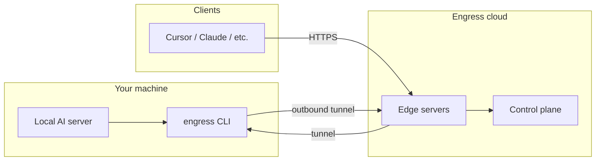

OVERVIEW

# How it works

Engress connects your local AI server to the internet without opening inbound ports on your firewall.

## Architecture (simplified)

## Step by step

1. **Install and sign in** — Run `engress login`. Your browser opens the Engress dashboard where you authenticate with your account.

2. **Create an endpoint** — Each endpoint gets a unique URL like `https://studio.edge.engress.io`.

3. **Start a tunnel** — Run `engress http 11434` (or your local port). The CLI dials **out** to Engress and forwards traffic to your machine.

4. **Point your AI tool** — Configure Cursor, Claude Code, or any OpenAI-compatible client to use your `*.edge.engress.io` URL.

## Why outbound-only?

Most networks block inbound connections. Because **engress** initiates the connection to Engress, it works through NAT, corporate firewalls, and home routers without port forwarding.

## Security layers

| Layer | What it does |
|-------|----------------|
| HTTPS | Valid TLS certificate on every tunnel hostname |
| Account sign-in | Clerk authentication in the browser |
| Connect tokens | Per-endpoint tokens you can revoke |
| mTLS | Encrypted agent tunnel on port 4433 |

See [Security](/security) for more detail.

## Related guides

- [engress CLI](/agent) — install and commands
- [Downloads](/downloads) — install options
- [Integrations](/integrations) — tool-specific setup
