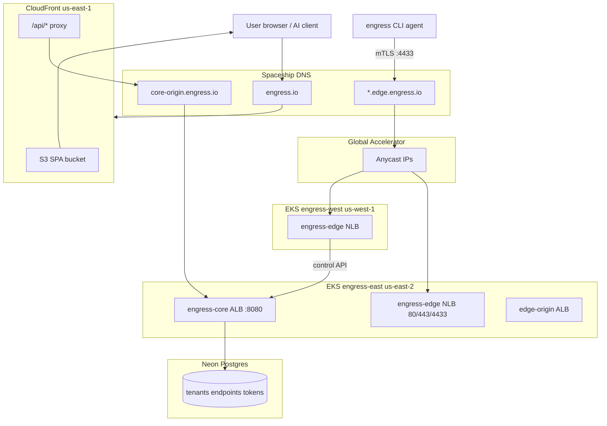

# System overview

**Last verified:** 2026-06-30

Engress exposes local AI models over HTTPS without inbound firewall rules. Users run the **engress** CLI on their machine; it dials **out** to the public edge. The control plane manages tenants, endpoints, and auth; the edge terminates TLS and forwards traffic through tunnels.

## Three-tier architecture

| Layer | Binary | Deploy target | Responsibility |
|-------|--------|---------------|----------------|
| Agent | `engress` | User laptop / CI | Outbound tunnel, local port forward |
| Control | `engress-core` | EKS `engress-east` | REST API, Clerk auth, Neon DB, cert minting |
| Edge | `engress-edge` | EKS east + west | Public TLS, tunnel accept, routing, ACME |

## Master topology

Source: [diagrams/system-overview.mmd](diagrams/system-overview.mmd)

## Request paths

### Dashboard and API (human / API key)

1. Browser loads `https://engress.io` → CloudFront → S3 SPA.
2. SPA calls `https://engress.io/api/v1/*` → CloudFront behavior `/api/*` → `core-origin.engress.io` → EKS core ALB → `engress-core` pods.

### Tenant tunnel (AI client → local model)

1. AI client calls `https://<subdomain>.edge.engress.io`.
2. DNS resolves `*.edge.engress.io` → Global Accelerator anycast IPs.
3. GA routes to east or west edge NLB (ports 80/443).
4. Edge forwards through yamux tunnel to agent on user machine.

### Agent registration (CLI)

1. Agent opens mTLS connection to `<subdomain>.edge.engress.io:4433`.
2. Agent presents connect token + client cert (minted by core).
3. Edge validates and registers tunnel session.

## Multi-region edge

| Region | Cluster | Workloads |
|--------|---------|-----------|
| `us-east-2` | `engress-east` | `engress-core` + `engress-edge` |
| `us-west-1` | `engress-west` | `engress-edge` only |

Core remains **east-only**. West edge pods call core via `https://core-origin.engress.io`.

Global Accelerator fronts both edge NLBs for `*.edge.engress.io` tenant traffic.

## Transport notes

| Feature | Status |
|---------|--------|
| TCP tunnel (yamux) | **Production default** |
| mTLS on `:4433` | **Required** (`mtls_mode: required`) |
| QUIC | Implemented in code; not default in production |
| Legacy insecure TLS | Off by default (`allowLegacyInsecure: false`) |

## Related docs

- [02-network-topology](02-network-topology.md) — DNS and port detail
- [05-identity-auth](05-identity-auth.md) — auth flows
- [P04 cutover narrative](../../docs/superpowers/narratives/2026-06-30-p04-eks-cutover-and-frontend-recovery.md)
- [P03 multi-region narrative](../../docs/superpowers/narratives/2026-06-30-p03-multi-region-load-balancing.md)
