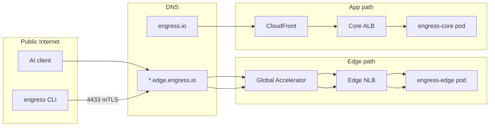

# Network topology

**Last verified:** 2026-07-01

## Live DNS snapshot (2026-07-01)

| Hostname | Record | Target |
|----------|--------|--------|
| `engress.io` | CNAME | `d1y7wdtfae903c.cloudfront.net` |
| `core-origin.engress.io` | CNAME | `k8s-engress-engressc-0e6d362187-1276529689.us-east-2.elb.amazonaws.com` |
| `edge-origin.engress.io` | CNAME | `k8s-engress-engresse-05043a6385-1111899267.us-east-2.elb.amazonaws.com` |
| `*.edge.engress.io` | A | `166.117.111.75`, `166.117.142.224` (GA anycast) |
| `clerk.engress.io` | CNAME | `frontend-api.clerk.services` |

**CloudFront:** `E1H1FGG5MSUPN5` → `d1y7wdtfae903c.cloudfront.net`

Full collector output: [appendix-live.md](appendix-live.md)

## DNS map (Spaceship registrar)

| Hostname / pattern | Record type | Target | Serves |
|--------------------|-------------|--------|--------|
| `engress.io` | CNAME | CloudFront distribution | SPA + `/api/*` |
| `get.engress.io` | CNAME | CloudFront | Marketing / redirects |
| `downloads.engress.io` | CNAME | CloudFront | CLI artifact downloads |
| `core-origin.engress.io` | A/CNAME | EKS core ALB (east) | API origin for CloudFront |
| `edge-origin.engress.io` | A/CNAME | EKS edge ALB (east) | Legacy origin hostname |
| `edge-origin-west.engress.io` | A/CNAME | EKS edge ALB (west) | West edge origin |
| `*.edge.engress.io` | A (anycast) | Global Accelerator IPs | Tenant tunnels |

**SSM source for GA IPs:** `engress-deploy-global-accelerator-ips` (comma-separated).

### DNS automation

| Script | Purpose |
|--------|---------|
| `./scripts/agent/spaceship-dns.sh list-table` | Live DNS records |
| `./scripts/agent/spaceship-dns.sh audit` | DNS vs LB/GA drift |
| `./scripts/agent/dispatch-ops.sh dns-audit` | Same via GitHub Actions |
| `./scripts/agent/dispatch-ops.sh dns-cutover-ga-apply` | Apply `*.edge` → GA A records |

Library: `scripts/deploy/lib/spaceship.sh`

## Ports

| Port | Protocol | Service | Exposure |
|------|----------|---------|----------|
| 80 | TCP | HTTP (ACME, redirect, health) | Edge NLB, edge ALB |
| 443 | TCP | HTTPS (tenant subdomains) | Edge NLB |
| 4433 | TCP | Agent tunnel (mTLS) | Edge NLB |
| 8080 | TCP | engress-core API | Core ALB (internal to CF path) |

Blocked ports for tunnel forwarding are defined in `sdk/ports/blocked.go` (VPN, torrent, unauthenticated DBs, etc.).

## Load balancers (EKS)

### East (`engress-east`, us-east-2)

| LB type | Chart | Hostname / use |
|---------|-------|----------------|
| ALB | `engress-core` | `core-origin.engress.io` :8080 |
| NLB | `engress-edge` | Public tunnel ingress 80/443/4433 |
| ALB | `engress-edge` ingress | `edge-origin.engress.io` :80 |

### West (`engress-west`, us-west-1)

| LB type | Chart | Hostname / use |
|---------|-------|----------------|
| NLB | `engress-edge` | Public tunnel ingress |
| ALB | `engress-edge` ingress | `edge-origin-west.engress.io` |

West edge `controlApiUrl` points to `https://core-origin.engress.io`.

## Global Accelerator

| Listener | Port | Endpoint groups |
|----------|------|-----------------|
| HTTP | 80 | East edge NLB, West edge NLB |
| HTTPS | 443 | East edge NLB, West edge NLB |
| Tunnel | 4433 | East edge NLB, West edge NLB |

Client IP preservation enabled on NLB target groups.

## CloudFront (`engress.io`)

| Behavior | Origin | Notes |
|----------|--------|-------|
| Default (`/`) | S3 SPA bucket `flux-spa-327796148992` | Static dashboard |
| `/api/*` | `core-origin.engress.io` | API proxy to EKS core |
| `/downloads/*` | S3 downloads bucket (if configured) | CLI artifacts |

ACM certificate in `us-east-1` (CloudFront requirement).

**Recovery:** `core/deploy/terraform/recover-frontend.sh` — see P04 narrative.

## Subdomain naming

Tenant endpoints receive unique subdomains under `.edge.engress.io`:

| Prefix pattern | Example | Typical use |
|----------------|---------|-------------|
| `https-*` | `https-studio.edge.engress.io` | HTTPS reverse proxy |
| `rdp-*` | `rdp-desk.edge.engress.io` | RDP tunnel |
| `tcp-*` | `tcp-5432.edge.engress.io` | Raw TCP |

Reserved names include `clerk`, `api`, `admin` — see `core/internal/subdomain/reserved.go`.

## VPC layout

| VPC | CIDR | Region | Used by |
|-----|------|--------|---------|
| East | `10.0.0.0/16` | us-east-2 | `engress-east` EKS |
| West | `10.1.0.0/16` | us-west-1 | `engress-west` EKS |

## Traffic flow diagram

## Related docs

- [03-aws-inventory](03-aws-inventory.md) — resource ARNs and IDs
- [ops/spaceship-dns.md](../core-docs/ops/spaceship-dns.md) — DNS operator patterns (updated for GA)
