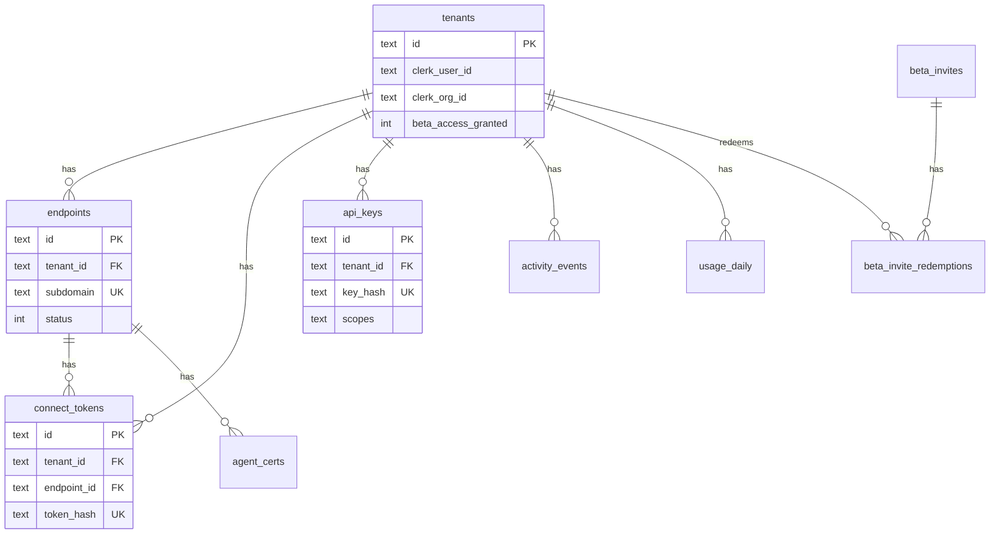

# Data layer

**Last verified:** 2026-06-30

## Database technology

| Component | Driver | Storage | Notes |
|-----------|--------|---------|-------|
| **engress-core** | PostgreSQL | Neon (serverless) | Authoritative tenant/endpoint data |
| **engress-edge (EKS)** | SQLite | `emptyDir` per pod (`/data/engress.db`) | Ephemeral local cache; `FLUX_USE_SSM=0` in Helm |
| **Local dev** | SQLite or Postgres | File or local DSN | `ENGRESS_DB_DRIVER` env |

**Neon project:** Engress (`wandering-night-10716713`)

**SSM connection strings (names only):**

- `neon-db-connection-string` — primary DSN for core
- `neon-db-read-replica-west-connection-string` — optional west read replica

No RDS or Aurora in Terraform.

## Schema (migrations)

Migrations live in `core/internal/store/migrations/` (mirrored in `edge/internal/store/migrations/`).

### Core tables

| Table | Migration | Purpose | Key columns / FKs |
|-------|-----------|---------|-------------------|
| `tenants` | 0001, 0002, 0004, 0007 | Org/user mapping | `clerk_user_id`, `clerk_org_id`, `beta_access_granted` |
| `endpoints` | 0001, 0003 | Tunnel endpoints | `tenant_id`, `subdomain`, `status` |
| `connect_tokens` | 0001, 0003 | Agent auth tokens | `tenant_id`, `endpoint_id`, `token_hash` |
| `api_keys` | 0002 | Machine API auth | `tenant_id`, `key_hash`, `scopes` |
| `platform_admins` | 0002 | Oasis / admin access | `clerk_user_id` |
| `audit_log` | 0002 | Operator audit trail | `actor_id`, `action` |
| `usage_daily` | 0002, 0004 | Per-day usage aggregates | `tenant_id`, `endpoint_id`, `day` |
| `agent_certs` | 0002 | mTLS cert registry | `endpoint_id`, `cert_pem`, `expires_at` |
| `activity_events` | 0003 | Tenant activity feed | `tenant_id`, `event_type` |
| `beta_invites` | 0004 | Beta invite codes | `code_hash`, `max_redemptions` |
| `beta_invite_redemptions` | 0004 | Redemption audit | `invite_id`, `tenant_id` |
| `oasis_jobs` | 0006 | Infra job runner | job status fields |

### Row-level security

Migration `0005_rls_postgres.sql` enables Postgres RLS policies for tenant isolation on production Neon.

## Entity relationship diagram

## Edge database note

Helm `engress-edge` ConfigMap sets SQLite with `FLUX_USE_SSM=0`. Each edge pod has an ephemeral `emptyDir` volume — tunnel connect-token validation on edge uses the local SQLite file populated at runtime (not shared across pods). Core remains the source of truth in Neon for API operations.

When `ENGRESS_USE_SSM=1` (EC2 legacy path), edge can use Neon via `ResolveEdgeDB` in `core/internal/config/secrets.go`.

## Go store layer

| File | Role |
|------|------|
| `core/internal/store/store.go` | Domain models + `Store` interface |
| `core/internal/store/postgres.go` | Postgres implementation |
| `core/internal/store/sqlite.go` | SQLite implementation |
| `core/internal/store/open.go` | Driver selection |

## Related docs

- [05-identity-auth](05-identity-auth.md) — how tokens and certs map to tables
- [07-secrets-config](07-secrets-config.md) — Neon DSN SSM parameters
