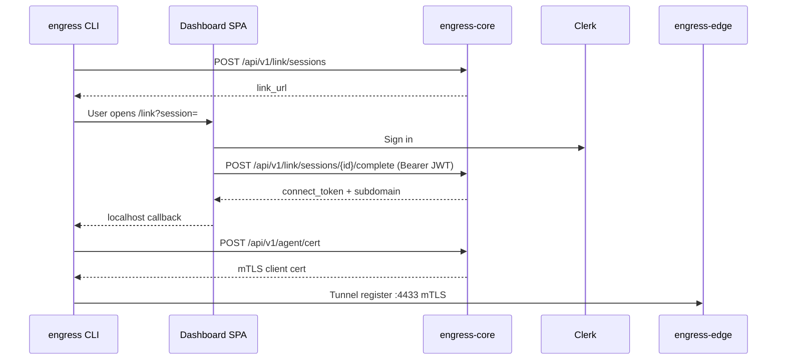

# Identity and authentication

**Last verified:** 2026-07-01

## Overview

Engress uses layered authentication: Clerk for humans, API keys for machines, connect tokens for agents, and mTLS for tunnel transport.

## Clerk integration

| Item | Value |
|------|-------|
| Provider | [Clerk](https://clerk.com) — Engress application |
| SPA SDK | `@clerk/react` in `core/web/` |
| Backend SDK | `core/internal/identity/clerk.go` |
| Webhook route | `POST /api/v1/clerk/webhook` |
| Custom domain | `clerk.engress.io` |
| Accounts domain | `accounts.engress.io` |
| Expected org | `org_3FN4VwPcUUsNUKi0yf6cdFLhG7J` |

### SSM / env (names only)

| SSM parameter | Env var | Purpose |
|---------------|---------|---------|
| `clerk-secret-key` | `CLERK_SECRET_KEY` | JWT verification |
| `next-clerk-publishable-key` | `VITE_CLERK_PUBLISHABLE_KEY` | SPA build-time key |
| `clerk-webhook-secret` | `CLERK_WEBHOOK_SECRET` | Svix webhook signature |

### Clerk operator scripts

```bash
./scripts/agent/clerk-auth.sh verify    # Keys match Engress app
./scripts/agent/clerk-auth.sh refresh   # SSM + redirect URLs + SPA + core
./deploy/agents/dispatch-ops.sh clerk-refresh  # Same via GHA
```

Library: `scripts/deploy/lib/clerk.sh`

### Webhook events

Handled in `core/cmd/apiroot/serve.go` via `identity.WebhookHandler`:

- Organization created/updated → `UpsertTenantFromClerkOrg`
- Billing events → `beta.HandleClerkBillingEvent` (beta plan `flux-beta`)

### Tenant resolution

`identity.ResolveTenant` maps Clerk JWT `sub` → `tenants.clerk_user_id` and active org → `tenants.clerk_org_id`. Auto-upsert on first authenticated request.

Platform admins: `platform_admins.clerk_user_id` table → Oasis routes.

## Auth mechanisms

| Mechanism | Header / transport | Used by |
|-----------|-------------------|---------|
| Clerk session JWT | `Authorization: Bearer <jwt>` | Dashboard SPA, link complete |
| API key | `Authorization: Bearer engress_sk_*` | Scripts, CI (legacy `flux_sk_*` accepted) |
| Connect token | Tunnel registration + cert mint | engress CLI |
| mTLS client cert | TLS :4433 | Agent tunnel after cert provision |
| Legacy HMAC cookie | `engress_session` cookie | Legacy `/api/login` paths |

Middleware: `core/internal/apiserver/middleware.go` → `authenticate()`.

## CLI link flow



Key files:

- `agent/internal/agentlink/flow.go` — CLI browser login
- `core/internal/apiserver/link.go` — link session handlers
- `core/web/src/pages/Link.tsx` — link completion UI
- `core/internal/apiserver/certs.go` — cert minting

## Tunnel authentication

| Step | Check |
|------|-------|
| mTLS | Client cert CN encodes endpoint ID; must match registration |
| Connect token | SHA-256 hash lookup in store |
| Beta gate | `beta_access_granted` required for endpoint create, link complete, cert mint |

Edge validation: `edge/internal/edge/wiring.go`

Tunnel CA: `sdk/pki/`, SSM `engress-tunnel-ca-cert-pem`, `engress-tunnel-ca-key-pem`

## API scopes

| Scope | Routes |
|-------|--------|
| `endpoints:read` | List endpoints, activity, stats |
| `endpoints:write` | Create, patch, delete endpoints |
| `tokens:read` | List connect tokens |
| `tokens:write` | Issue, revoke tokens |

API keys cannot access Oasis/platform admin routes.

## Beta billing (partial)

- `POST /api/v1/beta/sync-billing` — polls Clerk Billing API
- P06 full tier enforcement — planned (see [10-gap-register](10-gap-register.md))

## Related docs

- [04-data-layer](04-data-layer.md) — auth-related tables
- [ops/clerk-billing-ci-setup.md](../core-docs/ops/clerk-billing-ci-setup.md)
- Public: https://engress.io/docs/security
