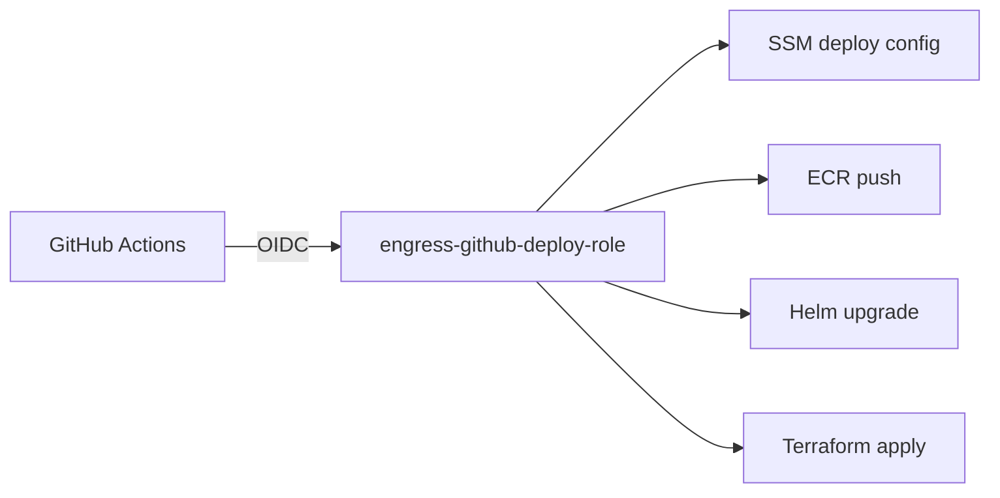
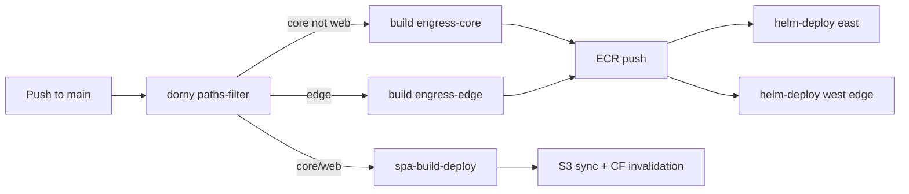

# CI/CD and deploy

**Last verified:** 2026-06-30

## Repository layout

| Repo | Submodule path | Role |
|------|----------------|------|
| `engress-io/engress` | `.` | Superproject — workflows, charts, specs |
| `engress-io/agent` | `agent/` | CLI binary |
| `engress-io/core` | `core/` | Control plane + SPA + Terraform |
| `engress-io/edge` | `edge/` | Data plane |
| `engress-io/deploy` | `deploy/` | Terraform mirror, Helm, operator scripts |
| `engress-io/docs` | `docs/` | Docusaurus customer docs |
| `engress-io/scripts` | `scripts/` | Deploy shims, Taskfile, agent scripts |
| `engress-io/sdk` | `sdk/` | Shared Go packages |
| `engress-io/internal-docs` | `internal-docs/` | Private operator docs (this atlas) |

## GitHub Actions workflows

| Workflow | File | Trigger | Target |
|----------|------|---------|--------|
| **deploy-staging** | `.github/workflows/deploy-staging.yml` | Push `main` (path filter) | Staging EKS — primary on main |
| **deploy-production** | `.github/workflows/deploy-production.yml` | After staging success / manual | Production (approval gate) |
| **deploy-k8s** | `.github/workflows/deploy-k8s.yml` | Manual only | Emergency prod reconcile |
| **ops** | `.github/workflows/ops.yml` | Manual / `dispatch-ops.sh` | Terraform, Helm, DNS, Clerk, SPA |
| **ci** | `.github/workflows/ci.yml` | Push `main` | EC2 fallback (only if `engress-deploy-target=ec2`) |
| **health-check** | `.github/workflows/health-check.yml` | Cron 5 min | `curl https://engress.io/api/healthz` |
| **agent release** | `agent/.github/workflows/release.yml` | Release tag | S3 downloads sync |

## Auth chain



Bootstrap secret in GitHub: `AWS_DEPLOY_ROLE_ARN`  
All other deploy config: SSM (via `scripts/deploy/lib/ssm-deploy-config.sh`)

**SSM deploy target:** `engress-deploy-target` = `eks` (production)

## Deploy pipeline (EKS)



Image tag: git short SHA. Charts: `charts/engress-core`, `charts/engress-edge`.

## Component-scoped deploy rules

| Change path | CI / dispatch action |
|-------------|---------------------|
| `core/web/**` | `spa-deploy` |
| `core/**` (not web) | `helm-deploy-core` |
| `edge/**` | `helm-deploy-edge` (east + west) |
| `charts/**`, `deploy/helm/**` | `helm-deploy` / `helm-deploy-west` (no rebuild) |
| `deploy/terraform/**` | `plan-stack` → `apply-stack` |
| Docs only | No deploy |

**Never** dispatch `helm-deploy-all`, `apply-foundation`, `p03-rollout`, or `fix-lbs` unless explicitly required.

Full matrix: [deploy/docs/deployment-matrix.md](../../deploy/docs/deployment-matrix.md)

## Operator dispatch

```bash
./deploy/agents/dispatch-ops.sh <action>    # canonical
./scripts/agent/dispatch-ops.sh <action>    # shim
```

Cloud agents use `repository_dispatch` (no PAT required). Optional `ENGRESS_GH_PAT` for `workflow_dispatch` fallback.

### Common actions

| Action | Scope |
|--------|-------|
| `spa-deploy` | SPA only |
| `helm-deploy-core` | Core east |
| `helm-deploy-edge` | Edge east + west |
| `kubectl-status` | Cluster health |
| `dns-audit` | DNS vs LB drift |
| `smoke-test` | Health checks |
| `plan-stack stack=eks-east` | Terraform plan |
| `apply-stack stack=eks-east` | Terraform apply (plan-guard) |
| `audit-ssm-tfvars` | Verify tfvars flags |
| `clerk-refresh` | Clerk keys + SPA + core |

## Terraform deploy safety (P08)

- SSM `engress-terraform-tfvars` is sole source of `enable_*` flags
- `deploy/scripts/guards/plan-guard.sh` blocks protected destroys
- `apply-stack.sh` for targeted stack applies
- `prevent_destroy` on EKS, GA, SPA bucket

## Agent release pipeline

Release tag on `agent` repo → build binaries → sync to `flux-downloads-327796148992` → `https://engress.io/downloads/latest/`

## Related docs

- [deploy/AGENTS.md](../../deploy/AGENTS.md) — agent deploy rules
- [07-secrets-config](07-secrets-config.md) — SSM parameters
- [P08 narrative](../../docs/superpowers/narratives/2026-06-30-p08-deploy-submodule-and-infra-safety.md)
