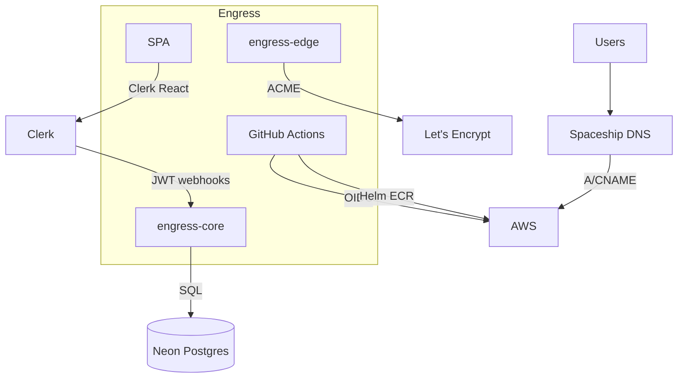

# Third-party services

**Last verified:** 2026-07-01

## Service map

| Service | Role | Console / API | Secrets location |
|---------|------|---------------|------------------|
| **AWS** | Compute, CDN, DNS-adjacent, state | Account `327796148992` | SSM + IRSA |
| **Neon** | Serverless Postgres | Project `wandering-night-10716713` | SSM `neon-db-connection-string` |
| **Clerk** | Identity, orgs, billing (beta) | Engress application | SSM + GHA secrets |
| **Spaceship** | DNS registrar + API | `engress.io` zone | Cursor/GHA: `SPACESHIP_API` + `SPACESHIP_SECRET` |
| **GitHub** | Source, CI, OIDC | `engress-io` org | `AWS_DEPLOY_ROLE_ARN` in GHA |
| **Homebrew** | Agent distribution | `engress-io/tap` | Public tap, no secrets |
| **Let's Encrypt** | Edge TLS certs | ACME v2 | Email `ops@engress.io` in edge config |

## AWS

- **Profile:** `ghostweasel-flux` (local operators)
- **Regions:** `us-east-2` (primary), `us-west-1` (west edge), `us-east-1` (CloudFront ACM)
- **Support access:** SSO login or GHA OIDC via `engress-github-deploy-role`

## Neon

| Item | Value |
|------|-------|
| Project name | Engress |
| Project ID | `wandering-night-10716713` |
| Used by | `engress-core` (authoritative data) |
| Migrations | `core/internal/store/migrations/` |
| RLS | Enabled via migration 0005 |

**Manual verification:** Neon console → branches, connection pooling, backup retention.

## Clerk

| Item | Value |
|------|-------|
| Application | Engress (production `pk_live_` / `sk_live_`) |
| Custom domain | `clerk.engress.io` → `frontend-api.clerk.services` |
| Accounts domain | `accounts.engress.io` → `accounts.clerk.services` |
| Expected org | `org_3FN4VwPcUUsNUKi0yf6cdFLhG7J` |
| SPA integration | `@clerk/react` — `core/web/src/lib/clerk.tsx` |
| Webhook URL | `https://engress.io/api/v1/clerk/webhook` |
| Organizations | Enabled for multi-tenant mapping |
| Billing | Beta sync active; full P06 tiers planned |

**Operator scripts:** `scripts/agent/clerk-auth.sh`, `scripts/deploy/lib/clerk.sh`

**Manual verification:** Clerk dashboard → Paths, redirect URLs, webhook endpoints, JWT templates.

## Spaceship

| Item | Detail |
|------|--------|
| Zone | `engress.io` |
| API | Used by `scripts/deploy/lib/spaceship.sh` |
| Key records | Apex → CF, `*.edge` → GA anycast A |

**Operator scripts:** `scripts/agent/spaceship-dns.sh`

Skill: `.cursor/skills/spaceship-dns/SKILL.md`

## GitHub

| Item | Detail |
|------|--------|
| Org | `engress-io` |
| Superproject | `engress-io/engress` |
| OIDC | `engress-github-deploy-role` |
| Agent secrets | Cursor cloud: see `AGENTS.md` |

Submodules are independent repos with their own CI (sdk-compat, release workflows).

## Connection diagram

## Related docs

- [05-identity-auth](05-identity-auth.md) — Clerk detail
- [04-data-layer](04-data-layer.md) — Neon detail
- [02-network-topology](02-network-topology.md) — Spaceship DNS detail
