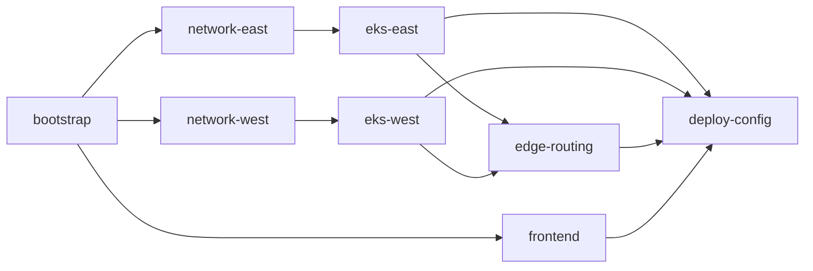

# P08 — Deploy Submodule & Infra Safety — Implementation Plan

> **Goal:** Create `engress-io/deploy` submodule, consolidate infrastructure assets, and make accidental destruction structurally difficult.

**Design spec:** `specs/2026-06-30-p08-deploy-submodule-design.md`

**Narrative:** [2026-06-30-p08-deploy-submodule-and-infra-safety.md](../narratives/2026-06-30-p08-deploy-submodule-and-infra-safety.md)

**Related incident:** 2026-06-30 west EKS + GA destroyed by `apply-eks` with partial `-var` flags; recovered manually.

---

## Summary

| Phase | Deliverable | Risk | Can ship alone? |
|-------|-------------|------|-----------------|
| **0** | Design + repo scaffold | None | ✅ |
| **1** | Safety rails (plan-guard, tfvars lock) | Low | ✅ **Do first** |
| **2** | `deploy` submodule + copy assets | Medium | ✅ |
| **3** | Split Terraform state (4–8 stacks) | High | Needs careful state mv |
| **4** | Wire CI/GHA + deprecate old paths | Medium | ✅ |
| **5** | GitOps + staging (optional) | Low | Later |

---

## Phase 0 — Scaffold (1 PR)

### 0.1 Create GitHub repo

- [ ] Create `engress-io/deploy` (empty + README)
- [ ] Add submodule to superproject: `deploy/` → `engress-io/deploy`
- [ ] Branch protection: require plan-guard check on PRs touching `terraform/`

### 0.2 Directory skeleton

Copy structure from design spec (empty stacks, `modules/`, `guards/`, `agents/`).

### 0.3 Docs

- [ ] `deploy/README.md` — layer diagram, dispatch cheatsheet
- [ ] `specs/2026-06-30-p08-deploy-submodule-design.md` (this design)
- [ ] Update superproject `AGENTS.md` with P08 status block

**Exit criteria:** Submodule clones; no behavior change.

---

## Phase 1 — Safety rails (1–2 PRs, **no submodule required**)

Ship immediately in `scripts/` + `core/deploy/terraform/` — prevents repeat incident while migration proceeds.

### 1.1 Lock tfvars intent

- [ ] Audit SSM `engress-terraform-tfvars` — must include:
  ```hcl
  enable_eks              = true
  enable_eks_west         = true
  enable_global_accelerator = true
  deploy_target           = "eks"
  ```
- [ ] Change `ops-terraform.sh`: **remove all `-var enable_*` overrides**; apply uses SSM tfvars only
- [ ] Rename actions for clarity:
  | Old | New |
  |-----|-----|
  | `apply-eks` | `apply-foundation` (deprecated alias) |
  | `apply-eks-west` | `apply-stack` with `stack=eks-west` |
  | `apply-ga` | `apply-stack` with `stack=edge-routing` |

### 1.2 Plan guard

- [ ] Add `scripts/deploy/scripts/plan-guard.sh`:
  - Input: `terraform plan -out=plan.bin`
  - Fail on protected resource deletes unless `ALLOW_INFRA_DESTROY=1`
  - Print human-readable destroy summary
- [ ] Wire into `ops-terraform.sh` before every apply
- [ ] Wire into GHA `ops.yml` apply steps

### 1.3 `prevent_destroy` on critical resources

- [ ] `aws_eks_cluster` (east + west modules)
- [ ] `aws_globalaccelerator_accelerator`
- [ ] SPA S3 bucket (`flux-spa-*`)
- [ ] Terraform state bucket (already done)

### 1.4 Helm safety

- [ ] Remove `IMAGE_TAG=latest` default from `ops.yml` helm steps — use `git rev-parse --short HEAD` or SSM tag
- [ ] Fix `helm-deploy-eks.sh` empty `CORE_VALUES[@]` bash bug (`set -u` safe)

**Exit criteria:** Re-running old `apply-eks` command either fails plan-guard or uses full SSM tfvars (no partial destroy).

---

## Phase 2 — Populate deploy submodule (2–3 PRs)

### 2.1 Move Helm charts

| From | To |
|------|-----|
| `charts/engress-core/` | `deploy/helm/engress-core/` |
| `charts/engress-edge/` | `deploy/helm/engress-edge/` |

- [ ] Update `helm-deploy-eks.sh` → `CHARTS_ROOT=$ENGRESS_DEPLOY_ROOT/helm`
- [ ] Leave `charts/` superproject symlink or README shim → `../deploy/helm`

### 2.2 Move operator scripts

| From | To |
|------|-----|
| `scripts/deploy/scripts/*` | `deploy/scripts/workload/`, `cluster/`, `smoke/` |
| `scripts/deploy/lib/*` | `deploy/scripts/lib/` |
| `scripts/agent/*` | `deploy/agents/` |

- [ ] New `deploy/scripts/lib/workspace.sh` with `ENGRESS_DEPLOY_ROOT`
- [ ] Old `scripts/deploy/` → thin wrappers:
  ```bash
  # scripts/deploy/scripts/helm-deploy-eks.sh (shim)
  exec "$(git rev-parse --show-superproject-working-tree)/deploy/scripts/workload/helm-deploy-east.sh" "$@"
  ```

### 2.3 Move Dockerfiles

| From | To |
|------|-----|
| `core/deploy/Dockerfile` | `deploy/docker/Dockerfile.edge` |
| `core/deploy/Dockerfile.api` | `deploy/docker/Dockerfile.core` |

- [ ] Update `build-push-ecr.sh` build context paths
- [ ] Update `edge/.github/workflows/release.yml` if it references core Dockerfile
- [ ] Leave shim `core/deploy/Dockerfile` → `../../deploy/docker/...` or documented copy

### 2.4 Copy Terraform (monolith first)

- [ ] Copy `core/deploy/terraform/` → `deploy/terraform/_legacy-monolith/` (unchanged initially)
- [ ] `apply-stack.sh` delegates to monolith with stack-specific `-target` **or** full apply with locked tfvars
- [ ] Do **not** split state yet — behavior parity first

**Exit criteria:** `dispatch-ops.sh helm-deploy-all` works via `deploy/` paths; old paths still work via shims.

---

## Phase 3 — Split Terraform state (2–4 PRs, highest care)

### 3.1 Extract modules

- [ ] `deploy/terraform/modules/eks-cluster/`
- [ ] `deploy/terraform/modules/irsa-role/`
- [ ] `deploy/terraform/modules/vpc-engress/`
- [ ] `deploy/terraform/modules/ssm-deploy-param/`

### 3.2 Stack cutover order



| Step | Action | Verification |
|------|--------|--------------|
| 3.2.1 | `terraform state pull` backup to S3 dated prefix | — |
| 3.2.2 | Import/bootstrap stack (state bucket already exists — import only) | plan = 0 changes |
| 3.2.3 | `state mv` VPC east → `network-east` | plan = 0 |
| 3.2.4 | `state mv` VPC west → `network-west` | plan = 0 |
| 3.2.5 | `state mv` EKS east + IRSA → `eks-east` | plan = 0 |
| 3.2.6 | `state mv` EKS west → `eks-west` | plan = 0 |
| 3.2.7 | `state mv` GA → `edge-routing` | plan = 0 |
| 3.2.8 | `state mv` CloudFront/SPA → `frontend` | plan = 0 |
| 3.2.9 | `state mv` SSM deploy params → `deploy-config` | plan = 0 |
| 3.2.10 | Delete monolith state key after 7-day bake | — |

### 3.3 Per-stack apply script

```bash
# deploy/scripts/terraform/apply-stack.sh
STACK="${1:?stack name}"
TF_DIR="$ENGRESS_DEPLOY_ROOT/terraform/$STACK"
engress_load_tfvars_from_ssm   # → /tmp/prod.tfvars
terraform -chdir="$TF_DIR" plan -var-file=/tmp/prod.tfvars -out=plan.bin
plan-guard plan.bin
terraform -chdir="$TF_DIR" apply plan.bin
```

**Exit criteria:** `apply-stack eks-east` updates Oasis IRSA without planning west destroys.

---

## Phase 4 — CI integration & deprecation (1–2 PRs)

### 4.1 GHA updates

- [ ] `ops.yml` — all script paths → `deploy/scripts/`, `deploy/agents/`
- [ ] `ci.yml` / `deploy-k8s.yml` — checkout `engress-io/deploy` submodule or repo
- [ ] Add GHA `environment: production` approval on foundation applies
- [ ] Upload `plan.bin` artifact on every plan

### 4.2 Remove shims

- [ ] Delete `charts/` from superproject root
- [ ] Delete `scripts/deploy/` (or reduce to 3-line exec shims with deprecation warning)
- [ ] Delete `core/deploy/terraform/` (keep `core/web/` only)
- [ ] Update `Taskfile.yml` paths

### 4.3 Operator doc sweep

- [ ] `AGENTS.md`, `deploy/README.md`, Oasis runbooks
- [ ] `.cursor/skills/*` path updates

**Exit criteria:** Grep for `core/deploy/terraform` and `scripts/deploy` returns only historical docs.

---

## Phase 5 — Optional hardening

- [ ] **Argo CD** — watch `deploy/helm/values-prod.yaml`; CI only pushes images + bumps tag
- [ ] **Checkov/tfsec** in deploy repo CI
- [ ] **Oasis infra panel** — last apply SHA, plan-guard status, GA DNS match, tfvars drift indicator
- [ ] **Staging** — duplicate stack prefix with `env/staging.tfvars` when P07a account exists

---

## Work breakdown (todos)

### Immediate (this week)

1. Phase 1.1 — SSM tfvars audit + remove `-var` overrides
2. Phase 1.2 — `plan-guard.sh`
3. Phase 1.3 — `prevent_destroy` on EKS + GA
4. Phase 0.1 — create `engress-io/deploy` repo + submodule

### Next

5. Phase 2.1–2.3 — move charts, scripts, docker
6. Phase 2.4 — terraform copy to deploy (monolith)
7. Phase 4.1 — GHA path updates

### Later (scheduled maintenance window)

8. Phase 3 — state split with backups + 0-change plans

---

## Rollback plan

| Phase | Rollback |
|-------|----------|
| 1 | Revert script changes; SSM tfvars unchanged |
| 2 | Shims point back to old paths; submodule optional |
| 3 | Restore monolith state from S3 backup; re-import |
| 4 | Revert GHA to previous workflow SHA |

---

## Decision log

| Decision | Rationale |
|----------|-----------|
| New repo vs folder in superproject | Submodule matches agent/core/edge pattern; deploy has its own CI and lifecycle |
| Split state vs monolith + plan-guard | Both — guard ships Phase 1; split ships Phase 3 |
| Keep workflows in superproject | OIDC secrets and repo identity stay at engress-io/engress |
| Don't move `core/web` | Application source ≠ infrastructure |
| SSM tfvars as sole intent | Eliminates `-var` foot-gun that caused west destruction |

---

## Verification matrix (post Phase 4)

| Test | Command | Pass |
|------|---------|------|
| Plan guard blocks EKS destroy | `enable_eks_west=false` in temp vars → plan | exit 1 |
| East IRSA only apply | `apply-stack eks-east` | 0 west changes |
| Helm east | `helm-deploy-east` | pods Running, version SHA |
| Helm west | `helm-deploy-west` | pods Running |
| SPA | `spa-build-deploy` | /oasis loads |
| GA DNS | `dns-cutover-audit` | IPs match SSM |
| CI | push to main | build + push green |
| Oasis dashboard | platform admin GET /api/v1/oasis/dashboard | 200 + clusters |
